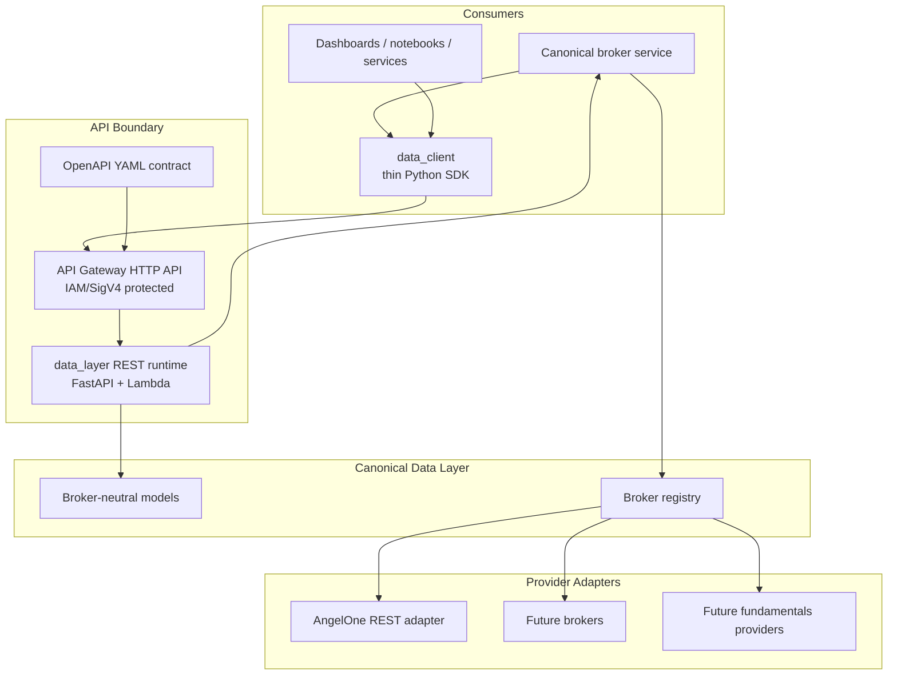
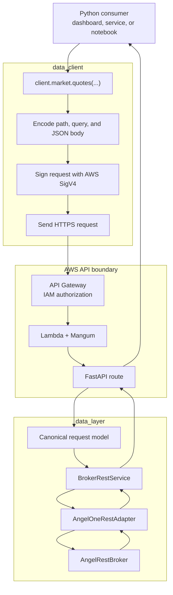

# Capital Alpha Platform

Capital Alpha Platform is a modular Python platform for market-data access,
broker integration, and downstream analytical workflows. The engineering goal
is to build a reliable data foundation: clean inputs, explicit contracts,
auditable processing, and useful outputs for a human operator.

This repository represents the reusable platform layer. Proprietary alpha
models, ranking logic, strategy formulas, private prompts, and confidential
datasets are intentionally excluded.

## Why This Exists

Retail and semi-professional market workflows often fail for engineering
reasons before they fail for investment reasons:

- market data is fragmented across brokers, APIs, scripts, and spreadsheets
- broker integrations leak provider-specific details into application logic
- analysis workflows are hard to reproduce or audit
- automation is added before the data boundary is trustworthy
- systems become expensive or complex before product-market fit is proven

Capital Alpha addresses this by starting with a strong platform foundation:

- canonical data contracts before higher-level workflows
- explicit provider adapters instead of hidden broker coupling
- API-first access for dashboards, services, notebooks, and future agents
- low-cost AWS deployment primitives for early-stage operation
- testable boundaries that can support larger application workflows

The intended outcome is not a black-box trading bot. It is a high-trust
platform foundation for market data, broker access, monitoring, and downstream
decision-support applications.

## Current State

The repository is no longer only an architecture sketch. The implemented
foundation now includes:

| Area | Status | Notes |
| --- | --- | --- |
| Data-layer REST runtime | Implemented | FastAPI app with Lambda/Mangum entrypoint |
| OpenAPI contract | Implemented | YAML contract with security, errors, CORS, route metadata |
| AngelOne REST integration | Implemented for market data | LTP, quotes, candles, scrip lookup/listing |
| Canonical broker layer | Implemented | Broker-neutral models, ports, registry, service |
| Data client SDK | Implemented | Thin Python client with IAM/SigV4 signing |
| DataFrame output | Implemented | Optional client-side conversion for analytical workflows |
| AWS infrastructure | Implemented foundation | CloudFormation for network, S3, Lambda, API Gateway, secrets pipeline |
| CI/CD workflows | Implemented foundation | GitHub Actions for tests and data-layer deployments |
| Account namespace | Contract visible, WIP | Routes retained but marked work-in-progress |
| Fundamentals namespace | Contract visible, WIP | Placeholder namespace for later providers |
| WebSocket runtime | Reserved | REST and WSS concerns intentionally separated |

## System Architecture

The platform is being built as a modular system with a strong data boundary.
The current implemented slice is the data access foundation.



The key design principle is separation of concerns:

```mermaid
flowchart LR
    subgraph ClientSide["data_client owns"]
        Urls["API URL construction"]
        SigV4["IAM/SigV4 request signing"]
        Http["HTTP transport"]
        Frames["Optional DataFrame output"]
    end

    subgraph DataLayer["data_layer owns"]
        Routes["REST route behavior"]
        Contracts["Canonical contracts"]
        Validation["Request validation"]
        Errors["Error normalization"]
    end

    subgraph BrokerSide["broker adapters own"]
        Payloads["Provider payloads"]
        Sessions["Provider auth/session"]
        Instruments["Instrument resolution"]
        Sdk["Broker SDK calls"]
    end

    ClientSide --> DataLayer --> BrokerSide
```



## Implemented Components

### `data_layer`

`data_layer` is the broker-facing service boundary. It exposes broker-neutral
REST APIs and delegates provider-specific behavior to adapters.

Implemented responsibilities:

- FastAPI REST runtime
- Lambda handler via Mangum
- canonical broker models, registry, ports, and service
- AngelOne REST adapter for market data
- Pydantic request validation
- structured HTTP error handling
- OpenAPI contract in YAML
- work-in-progress account and fundamentals namespaces

More detail: [data_layer/README.md](./data_layer/README.md)

### `data_client`

`data_client` is a thin Python SDK for downstream applications. It exists so
consumers do not need to know API Gateway, SigV4, URL construction, or
response-shaping details.

Implemented responsibilities:

- one root client: `DataLayerClient.from_env()`
- dynamic API URL resolution
- IAM/SigV4 signing for protected endpoints
- unsigned `/health` access
- market endpoint helpers
- optional pandas DataFrame output
- unit tests and opt-in live integration tests

More detail: [data_client/README.md](./data_client/README.md)

### `infra/data_layer`

Infrastructure is intentionally scoped to the data-layer deployment path.

Implemented templates and parameter sets:

- network
- S3
- Lambda
- API Gateway
- Secrets Manager pipeline template
- OpenAPI rendering and validation scripts

The current direction favors low-cost, reviewable CloudFormation stacks before
introducing heavier orchestration.

### `.github/workflows`

GitHub Actions workflows cover:

- test checks
- data-layer network deployment
- data-layer S3 deployment
- data-layer Lambda deployment
- data-layer API Gateway deployment
- data-layer Secrets Manager stack deployment
- CloudFormation stack deletion utility

The Lambda workflow installs dependencies from
`data_layer/requirements-lambda.txt` and uses commit-SHA artifact keys instead
of a mutable `latest.zip`.

## API Surface

The current data-layer REST API exposes the following practical surface:

| Method | Path | Status | Auth |
| --- | --- | --- | --- |
| `GET` | `/health` | Ready | Public |
| `GET` | `/brokers` | Ready | IAM |
| `GET` | `/market/brokers` | Ready | IAM |
| `GET` | `/market/{broker}/{exchange}/intervals` | Ready | IAM |
| `GET` | `/market/{broker}/{exchange}/scrips` | Ready | IAM |
| `GET` | `/market/{broker}/{exchange}/ltp` | Ready | IAM |
| `POST` | `/market/{broker}/{exchange}/quotes` | Ready | IAM |
| `POST` | `/market/{broker}/{exchange}/candles` | Ready | IAM |
| `GET` | `/account/{broker}/*` | WIP | IAM |
| `GET` | `/funda/{market}` | WIP | IAM |

The OpenAPI contract is the source of truth:

[data_layer/data-layer-rest.openapi.yaml](./data_layer/data-layer-rest.openapi.yaml)

## Request Flow

Example: a downstream consumer asks for quotes.



This flow is deliberately boring. The client handles access mechanics, the data
layer handles canonical behavior, and adapters handle provider details.

## Design Decisions

| Decision | Why it matters |
| --- | --- |
| Modular monolith first | Keeps iteration fast and operational overhead low while boundaries are still forming |
| Canonical broker contracts | Prevents AngelOne or any provider from leaking into platform-level logic |
| Adapter/registry pattern | Allows additional brokers without rewriting routes or consumers |
| REST and WebSocket separation | Keeps request/response workflows independent from streaming workflows |
| OpenAPI-first hardening | Makes API behavior reviewable before more clients depend on it |
| IAM/SigV4 for private APIs | Uses AWS-native authorization without custom auth infrastructure |
| Public `/health` only | Preserves uptime checks without exposing data endpoints |
| Thin data client | Keeps downstream applications focused on product logic, not API plumbing |
| Explicit dependency files | Keeps Lambda packaging and local development auditable |
| Commit-SHA artifacts | Makes deployment artifacts traceable and avoids mutable release keys |

## Security and Operational Model

Current security posture:

- protected API Gateway routes are designed for IAM/SigV4 authorization
- `/health` is intentionally public
- broker credentials are supplied through runtime environment variables
- Secrets Manager infrastructure exists for future migration, but the current
  low-cost path continues to use environment configuration
- no real credentials, API keys, session tokens, or account identifiers should
  be committed
- account and fundamentals routes remain visible but are marked
  work-in-progress until contracts are finalized

Operational hardening already started:

- structured OpenAPI contract
- reusable error response schemas
- route-level WIP metadata for unfinished endpoint groups
- Lambda dependency file
- staged CloudFormation parameter files
- CI test workflow
- opt-in live integration tests for deployed data-client/API checks

## Testing Strategy

Testing is organized around boundaries:

| Boundary | Test focus |
| --- | --- |
| canonical broker layer | model normalization, registry behavior, service dispatch |
| AngelOne adapter/facade | payload translation, session behavior, error normalization |
| REST runtime | routes, validation, Lambda handler, error responses |
| data client | config, SigV4 signing, transport, endpoint mapping, DataFrame output |
| infra scripts | OpenAPI rendering and validation helpers |

Run the full suite:

```powershell
.\at-venv\Scripts\python.exe -m pytest -q
```

Run data-client tests:

```powershell
.\at-venv\Scripts\python.exe -m pytest tests\data_client -q
```

Run data-layer tests:

```powershell
.\at-venv\Scripts\python.exe -m pytest tests\data_layer -q
```

## Local Development

Prerequisites:

- Python `>=3.13`
- `uv` or the project virtual environment
- AWS credentials only when calling deployed protected APIs
- AngelOne credentials only when executing live broker-backed flows

Install/sync dependencies:

```powershell
uv sync
```

Run the data-layer REST runtime locally:

```powershell
.\at-venv\Scripts\python.exe -m data_layer.runtimes.rest.run
```

Use the data client:

```python
from data_client import DataLayerClient

client = DataLayerClient.from_env()
print(client.health())
print(client.market.brokers())
```

## Repository Map

```text
capital-alpha-platform/
|-- data_layer/
|   |-- runtimes/rest/          FastAPI and Lambda REST runtime
|   |-- brokers/canonical/      broker-neutral contracts and service
|   |-- brokers/angelone/rest/  AngelOne REST adapter and SmartAPI integration
|   |-- data-layer-rest.openapi.yaml
|   `-- requirements-lambda.txt
|
|-- data_client/
|   |-- client.py              public SDK entry point
|   |-- auth.py                IAM/SigV4 signing
|   |-- transport.py           stateless JSON HTTP transport
|   |-- output.py              raw/DataFrame output shaping
|   `-- README.md
|
|-- infra/data_layer/
|   |-- cfn/                   CloudFormation templates
|   |-- params/                environment parameter files
|   `-- scripts/               OpenAPI render/validation helpers
|
|-- tests/
|   |-- data_layer/
|   |-- data_client/
|   `-- infra/
|
|-- .github/workflows/
|-- pyproject.toml
|-- uv.lock
`-- README.md
```

## Progress So Far

Implemented foundation:

- Data-layer REST runtime with FastAPI and Lambda compatibility.
- Broker-neutral canonical service, registry, ports, and models.
- AngelOne market-data adapter for scrip lookup, LTP, quotes, and candles.
- OpenAPI contract for the data-layer REST surface.
- Thin Python data client with IAM/SigV4 signing and optional DataFrame output.
- AWS infrastructure foundation for network, storage, Lambda, API Gateway, and
  deployment workflows.
- Test coverage across canonical models, broker adapters, REST runtime, data
  client, and infrastructure helpers.
- Package-level engineering documentation for `data_layer` and `data_client`.

Next engineering milestones:

- Finalize account endpoint contracts.
- Add fundamentals provider support.
- Continue improving deployment validation and observability.
- Expand live integration coverage for deployed environments.
- Introduce WebSocket runtime without coupling it to REST concerns.

## Engineering Principles

The main rule I have followed is to keep the platform honest about its
boundaries. The data layer should expose broker-neutral behavior; anything
that knows about a provider's tokens, payload names, sessions, or quirks should
stay inside that provider's adapter.

I have kept the REST runtime intentionally thin. Routes should validate input,
call the canonical service, and return a predictable response. They should not
become the place where broker logic, instrument translation, or workflow
decisions accumulate.

I have also avoided adding broad abstractions before the use case is proven.
The code favors small modules with explicit responsibilities: config, signing,
transport, registry, adapter, schemas, and error mapping. That makes the system
easier to review and easier to change.

OpenAPI is treated as an API contract, not as generated paperwork. The client,
runtime, tests, and deployment configuration are expected to line up with that
contract.

The infrastructure choices are intentionally modest: low-cost AWS building
blocks, clear parameter files, and deployment artifacts that can be traced back
to a commit. The goal is to keep the system operable while the platform matures.

## Engineering Signals

This repository is meant to show how I think through a platform foundation. The
interesting work here is not a trading strategy; it is the shape of the system
around data access, external providers, API contracts, deployment, and testing.

There are a few design choices I would expect to discuss in a technical review:

- why I started with a modular monolith instead of splitting services early
- why broker-neutral contracts came before higher-level workflows
- why the provider adapter boundary matters when adding more brokers later
- why IAM/SigV4 changes the shape of the Python client
- why OpenAPI is maintained as a reviewed contract
- where I chose low-cost infrastructure and where I left room to harden later
- how tests are placed around boundaries instead of only around functions

The repo is intentionally more explicit than clever. The aim is to make the
tradeoffs visible: what is implemented now, what is still a placeholder, and
where the next hardening steps should happen.

## Scope Boundaries

Included:

- platform architecture
- market-data and broker integration boundaries
- REST API contracts
- client SDK for data-layer access
- AWS deployment foundation
- tests and documentation for implemented boundaries

Excluded:

- proprietary alpha logic
- strategy ranking formulas
- private research heuristics
- confidential datasets
- live credentials or account-specific data
- financial advice or execution guarantees

## Disclaimer

This repository is for software engineering and system design purposes. It does
not provide financial advice, investment advice, trading advice, or execution
guarantees. Any production use should include appropriate operational controls,
risk management, compliance review, and legal review.
