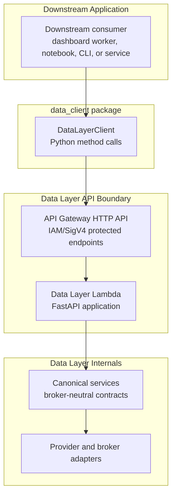
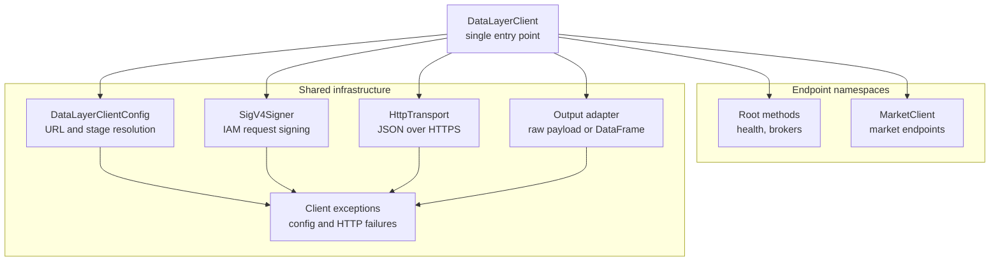
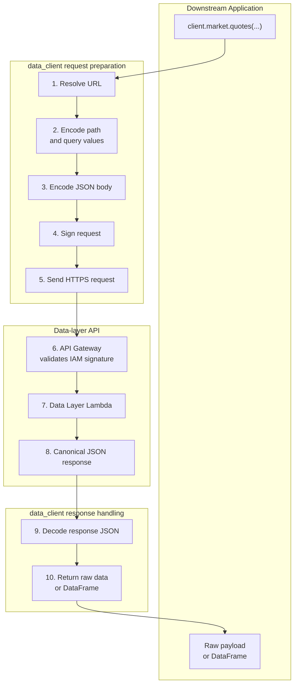
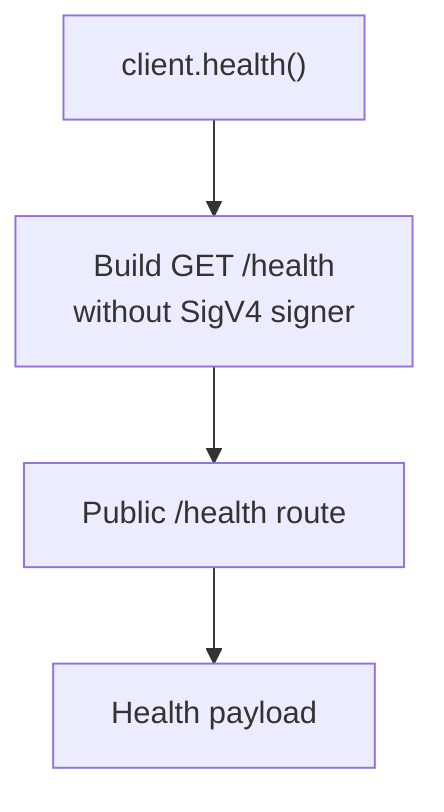
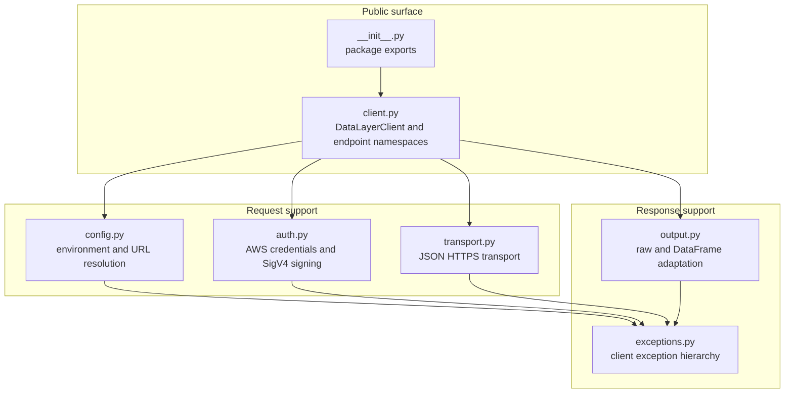

# Capital Alpha Data Client

`data_client` is the thin Python client for the Capital Alpha data-layer REST
API. It gives downstream applications one stable entry point for calling the
data layer without duplicating API Gateway URL construction, IAM/SigV4 signing,
HTTP transport behavior, or optional DataFrame shaping.

The client is intentionally small and stateless. It does not cache market data,
hold broker sessions, or implement broker-specific business rules. Canonical
market-data behavior stays in `data_layer`.

## Quick Start

Configure the API target and AWS credentials.

```powershell
$env:DATA_LAYER_API_BASE_URL="https://<api-id>.execute-api.<aws-region>.amazonaws.com/<stage>"
$env:AWS_ACCESS_KEY_ID="..."
$env:AWS_SECRET_ACCESS_KEY="..."
$env:AWS_SESSION_TOKEN="..." # only for temporary credentials
```

Or derive the base URL from API Gateway parts.

```powershell
$env:DATA_LAYER_API_ID="<api-id>"
$env:DATA_LAYER_AWS_REGION="<aws-region>"
$env:DATA_LAYER_STAGE="<stage>"
```

Use the client.

```python
from data_client import DataLayerClient

client = DataLayerClient.from_env()

print(client.health())
print(client.market.brokers())
```

`DATA_LAYER_API_BASE_URL` takes precedence when set. Otherwise, the client
builds the URL from `DATA_LAYER_API_ID`, `DATA_LAYER_AWS_REGION`, and
`DATA_LAYER_STAGE`.

## API Surface

| Method | REST path | Auth | Returns |
| --- | --- | --- | --- |
| `client.health()` | `GET /health` | No | health payload |
| `client.brokers()` | `GET /brokers` | Yes | REST broker list |
| `client.market.brokers()` | `GET /market/brokers` | Yes | market broker list |
| `client.market.intervals(...)` | `GET /market/{broker}/{exchange}/intervals` | Yes | candle intervals |
| `client.market.scrips(...)` | `GET /market/{broker}/{exchange}/scrips` | Yes | scrip labels |
| `client.market.ltp(...)` | `GET /market/{broker}/{exchange}/ltp` | Yes | latest traded price data |
| `client.market.quotes(...)` | `POST /market/{broker}/{exchange}/quotes` | Yes | quote data |
| `client.market.candles(...)` | `POST /market/{broker}/{exchange}/candles` | Yes | historical candles |

One client method maps to one API endpoint. Endpoint namespaces, such as
`client.market`, keep downstream code explicit without exposing REST plumbing.
Path parameters such as `broker` and `exchange` are URL-encoded by the client
before the request is signed and sent.

## Configuration Reference

| Variable | Required | Purpose |
| --- | --- | --- |
| `DATA_LAYER_API_BASE_URL` | Optional | Full API Gateway stage URL. Overrides API ID/region/stage. |
| `DATA_LAYER_API_ID` | Required if base URL is absent | API Gateway ID. |
| `DATA_LAYER_AWS_REGION` | Optional | API region. Falls back to `AWS_REGION`, then client default. |
| `DATA_LAYER_STAGE` | Optional | API Gateway stage. Falls back to client default. |
| `DATA_LAYER_TIMEOUT_SECONDS` | Optional | Per-request timeout. |
| `AWS_ACCESS_KEY_ID` | Required for signed endpoints | AWS access key for IAM/SigV4 signing. |
| `AWS_SECRET_ACCESS_KEY` | Required for signed endpoints | AWS secret key for IAM/SigV4 signing. |
| `AWS_SESSION_TOKEN` | Optional | Required only for temporary AWS credentials. |

For `/health`-only checks, credentials are not required.

```python
client = DataLayerClient.from_env(require_aws_credentials=False)
print(client.health())
```

## Architecture

`data_client` is a client-side adapter between a downstream Python application
and the deployed data-layer API.



Inside the package, each block has one narrow job.



Responsibility boundaries are deliberate.

```mermaid
flowchart LR
    subgraph ClientOwns["data_client owns"]
        MethodCalls["Python method calls"]
        Urls["API URL construction"]
        Signing["IAM/SigV4 signing"]
        Json["JSON request/response transport"]
        Frames["Optional DataFrame shaping"]
    end

    subgraph DataLayerOwns["data_layer owns"]
        Routes["FastAPI route behavior"]
        CanonicalModels["Canonical response contracts"]
        BrokerLogic["Broker/provider integration"]
        Validation["Request validation"]
        Runtime["Lambda runtime behavior"]
    end

    ClientOwns -. calls .-> DataLayerOwns
```



## Request Flow

Signed market requests follow this path.



`/health` is intentionally unsigned.



## Usage Examples

Sample market inputs below use `angelone`, `NSE`, and common equity symbols.
Replace them with the broker, exchange, and symbols appropriate to your
environment.

### Broker and Market Metadata

```python
from pprint import pprint
from data_client import DataLayerClient

client = DataLayerClient.from_env()

pprint(client.brokers())
pprint(client.market.brokers())
pprint(client.market.intervals(broker="angelone", exchange="NSE"))
pprint(client.market.scrips(broker="angelone", exchange="NSE"))
```

### LTP

```python
pprint(
    client.market.ltp(
        broker="angelone",
        exchange="NSE",
        symbol="SBIN",
    )
)
```

Multiple symbols can be passed as a list. The client sends the API's expected
comma-separated query value.

```python
pprint(
    client.market.ltp(
        broker="angelone",
        exchange="NSE",
        symbol=["SBIN", "RELIANCE", "VEDL"],
    )
)
```

### Quotes

```python
pprint(
    client.market.quotes(
        broker="angelone",
        exchange="NSE",
        symbols=["SBIN", "RELIANCE"],
        mode="LTP",
    )
)
```

Supported quote modes are `LTP`, `OHLC`, and `FULL`.

### Historical Candles

```python
pprint(
    client.market.candles(
        broker="angelone",
        exchange="NSE",
        symbol="SBIN",
        interval="ONE_MINUTE",
        from_time="2026-06-25 09:15",
        to_time="2026-06-25 09:30",
    )
)
```

## DataFrame Output

Raw JSON-like Python data is the default.

```python
payload = client.market.candles(
    broker="angelone",
    exchange="NSE",
    symbol="SBIN",
    interval="ONE_MINUTE",
    from_time="2026-06-25 09:15",
    to_time="2026-06-25 09:30",
)
```

Request a DataFrame per call when needed.

```python
frame = client.market.candles(
    broker="angelone",
    exchange="NSE",
    symbol="SBIN",
    interval="ONE_MINUTE",
    from_time="2026-06-25 09:15",
    to_time="2026-06-25 09:30",
    as_dataframe=True,
)
```

Candle DataFrames use:

```text
index: date formatted as YYYY-MM-DD HH:MM
columns: open, high, low, close, volume
```

You can also configure DataFrame output as the default.

```python
client = DataLayerClient.from_env(output="dataframe")
```

## Security Model

- Private endpoints are signed with AWS SigV4 for API Gateway IAM auth.
- `/health` is public and unsigned by design.
- The client reads credentials from standard AWS environment variables.
- The client does not store, refresh, or persist credentials.
- Query parameters are canonicalized before signing, including already encoded
  values generated by URL encoding.
- Path parameters are encoded as single URL path segments before signing.
- Do not commit real API URLs, access keys, secret keys, or session tokens.

## Failure Modes

| Symptom | Likely cause | What to check |
| --- | --- | --- |
| `DataLayerClientConfigError` | Missing local configuration | API URL vars, AWS credential vars, pandas availability |
| HTTP `401` or `403` | IAM auth failure | credentials, session token, IAM policy, API Gateway auth |
| HTTP `404` | Endpoint mismatch | OpenAPI contract, stage, route path, encoded path values |
| HTTP `429` | API throttling | retry policy in caller, API Gateway limits |
| HTTP `500` or `503` | data-layer runtime failure | Lambda logs, broker dependency, VPC/network path |
| status code `0` | local network failure | DNS, timeout, internet/VPC routing |

`DataLayerHttpError` exposes `status_code` and `payload` for caller-side
handling.

```python
from data_client import DataLayerClient, DataLayerClientError

try:
    client = DataLayerClient.from_env()
    payload = client.market.brokers()
except DataLayerClientError as exc:
    print(f"Data client failed: {exc}")
```

## Module Map



For code-level details:

- `client.py`: public API and endpoint namespaces
- `config.py`: environment and API URL resolution
- `auth.py`: AWS credentials and SigV4 signing, including canonical query handling
- `transport.py`: stateless JSON-over-HTTPS transport
- `output.py`: raw/DataFrame adaptation
- `exceptions.py`: client exception hierarchy
- `tests/data_client`: unit and opt-in live integration coverage

## Tests

Run unit tests without calling AWS.

```powershell
python -m pytest tests\data_client
```

CI runs the same `tests/data_client` suite as an explicit named step before the
broader repository test run. That keeps the client contract visible as a stable
gate for downstream consumers.

Live integration tests are skipped by default. Run them only when you want to
call a deployed API.

```powershell
$env:DATA_LAYER_RUN_INTEGRATION="1"
$env:DATA_LAYER_API_BASE_URL="https://<api-id>.execute-api.<aws-region>.amazonaws.com/<stage>"
$env:AWS_ACCESS_KEY_ID="..."
$env:AWS_SECRET_ACCESS_KEY="..."
$env:AWS_SESSION_TOKEN="..." # only for temporary credentials

python -m pytest tests\data_client\test_integration_live.py -vv
```

Optional live-test inputs:

```powershell
$env:DATA_LAYER_TEST_BROKER="angelone"
$env:DATA_LAYER_TEST_EXCHANGE="NSE"
$env:DATA_LAYER_TEST_SYMBOL="SBIN"
$env:DATA_LAYER_TEST_SYMBOLS="SBIN,RELIANCE"
$env:DATA_LAYER_TEST_INTERVAL="ONE_MINUTE"
$env:DATA_LAYER_TEST_FROM_TIME="2026-06-25 09:15"
$env:DATA_LAYER_TEST_TO_TIME="2026-06-25 09:30"
```

## Extension Rules

When adding a new endpoint group:

1. Add or update the OpenAPI contract.
2. Implement the route in `data_layer`.
3. Add a thin method under the matching client namespace.
4. Encode new path parameters before constructing endpoint paths.
5. Keep broker-specific logic out of `data_client`.
6. Add request-mapping and response-shaping tests.
7. Add SigV4 regression coverage when URL, query, or body signing behavior changes.
8. Add opt-in live integration coverage when the endpoint is stable.

Future namespaces should follow the existing shape.

```python
client.market.ltp(...)
client.fundamentals.company(...)
client.account.profile(...)
```
