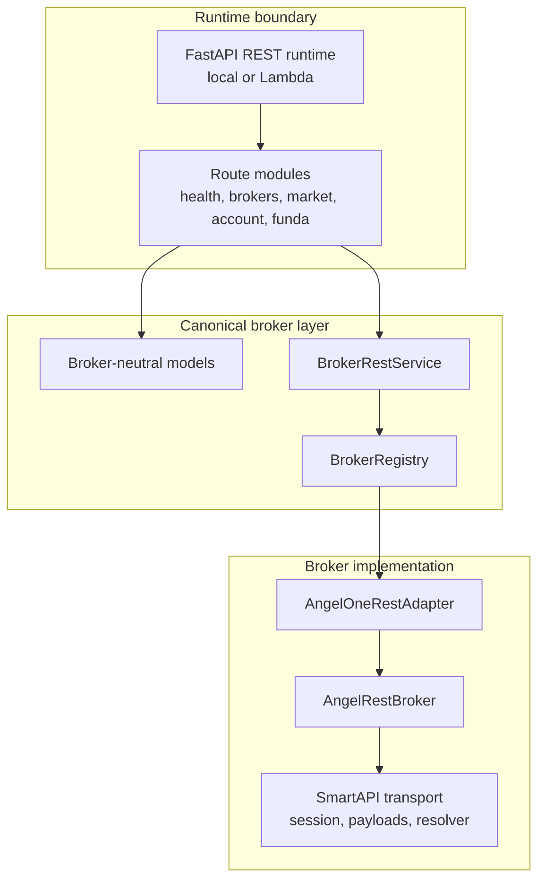
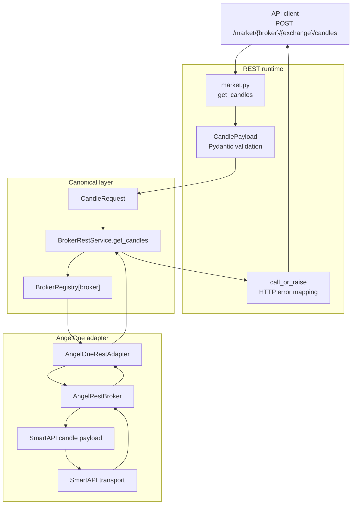
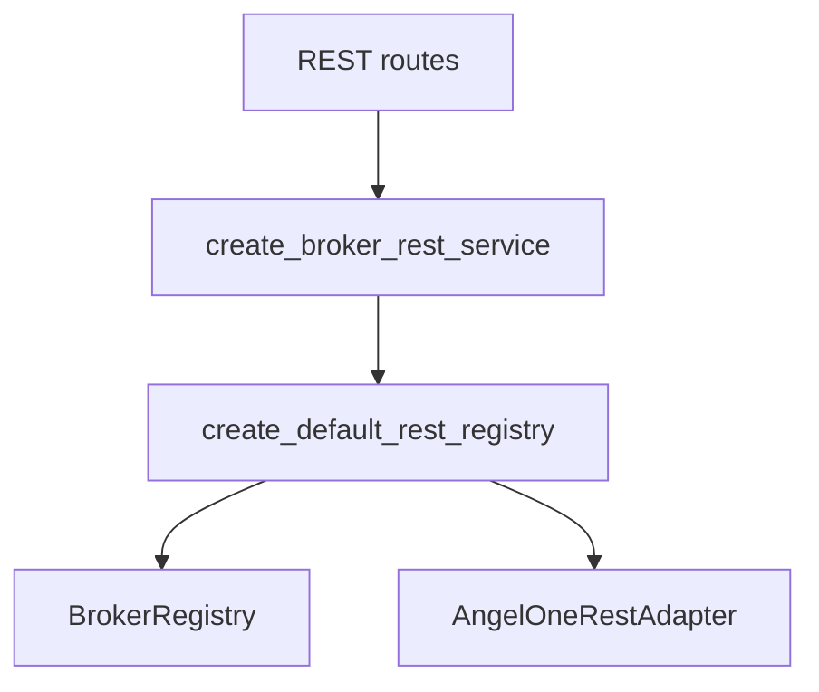
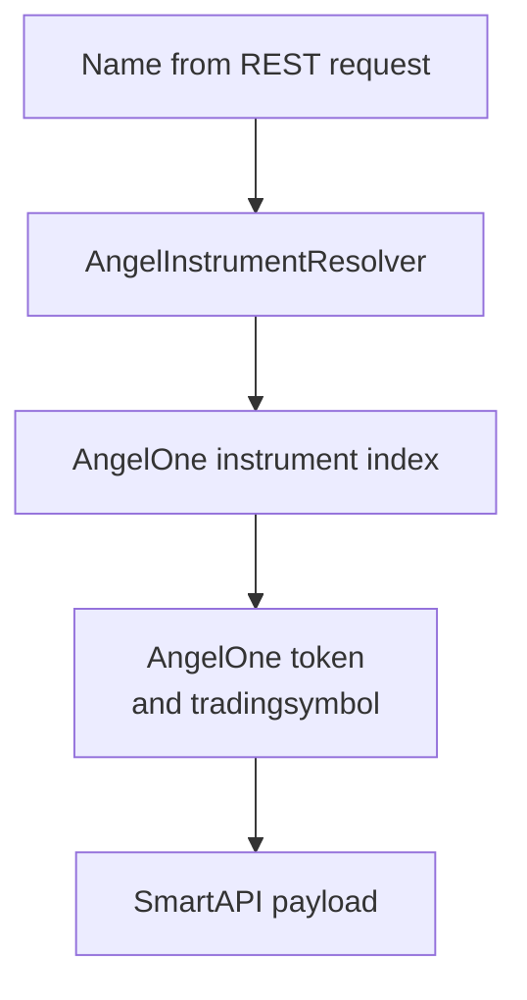
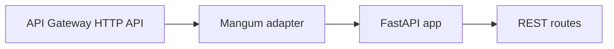
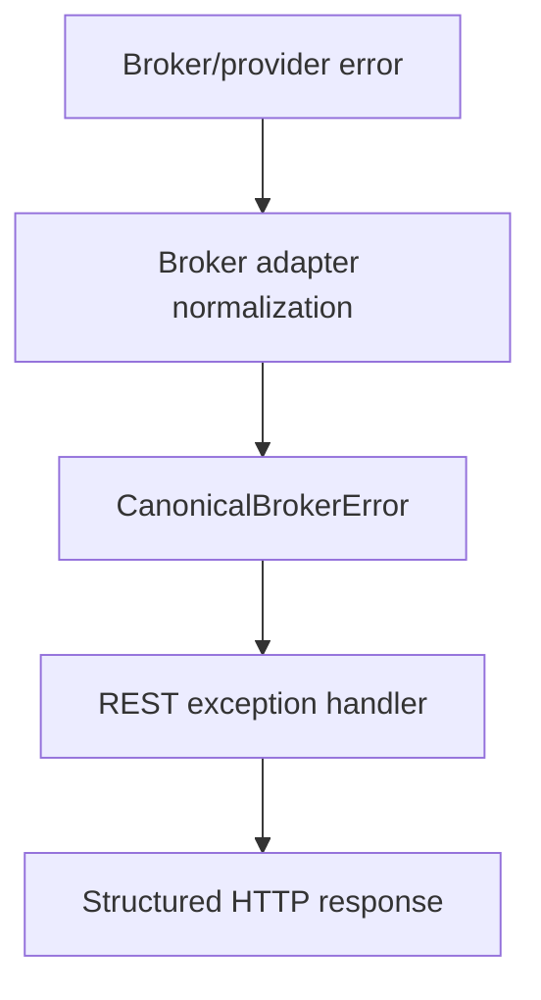
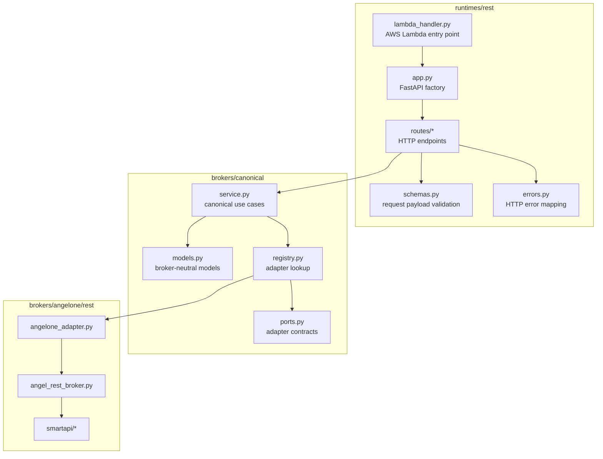

# Capital Alpha Data Layer

`data_layer` is the broker-facing service boundary for Capital Alpha. It
exposes broker-neutral REST contracts to clients and keeps provider-specific
translation, credentials, sessions, and SDK calls inside broker adapters.

The current runtime is a FastAPI application that can run locally or behind AWS
Lambda/API Gateway. Market-data endpoints are active. Account and fundamentals
namespaces are present but marked work-in-progress.

## Quick Start

Run the REST runtime locally.

```powershell
.\at-venv\Scripts\python.exe -m data_layer.runtimes.rest.run
```

Local runtime settings are environment-driven.

| Variable | Default | Purpose |
| --- | --- | --- |
| `REST_HOST` | `0.0.0.0` | Local bind host |
| `REST_PORT` | `8001` | Local bind port |
| `REST_RELOAD` | `false` | Uvicorn reload flag |
| `REST_LOG_LEVEL` | `debug` | Runtime log level |

AngelOne credentials are read from environment variables when credentials are
not explicitly injected.

| Variable | Purpose |
| --- | --- |
| `ANGELONE_API_KEY` | SmartAPI app API key |
| `ANGELONE_CLIENT_CODE` | AngelOne client code |
| `ANGELONE_PASSWORD` | AngelOne password |
| `ANGELONE_TOTP_SECRET` | TOTP secret for login |

## API Surface

| Method | Path | Status | Notes |
| --- | --- | --- | --- |
| `GET` | `/health` | Ready | Public health check |
| `GET` | `/brokers` | Ready | Compatibility broker discovery path |
| `GET` | `/market/brokers` | Ready | Market broker discovery |
| `GET` | `/market/{broker}/{exchange}/intervals` | Ready | Candle interval metadata |
| `GET` | `/market/{broker}/{exchange}/scrips` | Ready | Known scrip labels |
| `GET` | `/market/{broker}/{exchange}/ltp?symbol=...` | Ready | One or more comma-separated symbols |
| `POST` | `/market/{broker}/{exchange}/quotes` | Ready | `LTP`, `OHLC`, `FULL` modes |
| `POST` | `/market/{broker}/{exchange}/candles` | Ready | Historical candle data |
| `GET` | `/account/{broker}/profile` | WIP | Returns `work_in_progress` status |
| `GET` | `/account/{broker}/funds` | WIP | Returns `work_in_progress` status |
| `GET` | `/account/{broker}/holdings` | WIP | Returns `work_in_progress` status |
| `GET` | `/account/{broker}/positions` | WIP | Returns `work_in_progress` status |
| `GET` | `/account/{broker}/orders` | WIP | Returns `work_in_progress` status |
| `GET` | `/account/{broker}/trades` | WIP | Returns `work_in_progress` status |
| `GET` | `/funda/{market}` | WIP | Reserved fundamentals namespace |

The REST contract is documented in
[`data-layer-rest.openapi.yaml`](./data-layer-rest.openapi.yaml).

## Architecture

The data layer is organized around a canonical broker boundary. Runtimes call
canonical services. Canonical services call registered broker adapters. Broker
adapters own provider-specific translation.



Responsibility boundaries are deliberate.

```mermaid
flowchart LR
    subgraph RestOwns["REST runtime owns"]
        Http["HTTP routes"]
        Validation["Pydantic request validation"]
        ErrorMapping["HTTP error mapping"]
        Logging["Request logging"]
    end

    subgraph CanonicalOwns["Canonical layer owns"]
        Contracts["Broker-neutral contracts"]
        Dispatch["Broker dispatch"]
        Errors["Canonical errors"]
    end

    subgraph AdapterOwns["Broker adapters own"]
        Translation["Provider payload translation"]
        Session["Provider sessions and auth"]
        Instruments["Instrument resolution"]
        Sdk["Broker SDK calls"]
    end

    RestOwns --> CanonicalOwns
    CanonicalOwns --> AdapterOwns
```



## Request Flow

Example: historical candles.



Routes should stay thin. Request validation belongs at REST schema and
canonical model boundaries. Broker-specific lookups, tokens, payloads, and
session refresh stay inside broker modules.

## Canonical Broker Layer

The canonical layer is the broker-neutral contract used by runtimes and broker
adapters.

| Area | Request model | Response model |
| --- | --- | --- |
| Scrip lookup | `ScripRequest` | `ScripResponse` |
| Scrip list | `ScripListRequest` | `ScripListResponse` |
| LTP | `LtpRequest` | `LtpResponse` |
| Quotes | `QuoteRequest` | `QuoteResponse` |
| Candles | `CandleRequest` | `CandleResponse` |
| Account | `AccountRequest` | `AccountResponse` |

Broker SDK names, token fields, session details, and provider-specific payload
quirks must not leak into canonical models unless the public product contract
explicitly requires them.

## Broker Registry

Broker registration is centralized so route code does not instantiate concrete
broker classes.



Current REST broker:

```text
angelone
```

Future brokers should implement a canonical adapter and register through the
same factory path.

## AngelOne REST Module

AngelOne-specific behavior is split by responsibility.

| File | Responsibility |
| --- | --- |
| `angelone_adapter.py` | Translate canonical requests/responses to AngelOne operations |
| `angel_rest_broker.py` | Broker facade for AngelOne REST operations |
| `angel_instrument.py` | Parse and index AngelOne scrip master data |
| `smartapi/session.py` | SmartAPI login, TOTP, refresh, logout |
| `smartapi/transport.py` | SmartAPI SDK method calls |
| `smartapi/payloads.py` | Build SmartAPI LTP, quote, and candle payloads |
| `smartapi/instrument_resolver.py` | Resolve app symbols to AngelOne instruments |
| `smartapi/account.py` | Account operation wrappers |
| `smartapi/errors.py` | SmartAPI error normalization and retry behavior |

Instrument lookup is intentionally isolated.



## Market Limits

Market request limits are enforced at the REST boundary before broker calls.

| Limit | Current behavior |
| --- | --- |
| Quote symbols | Max `50` symbols per request |
| Multi-symbol LTP | Max `50` comma-separated symbols |
| Quote modes | `LTP`, `OHLC`, `FULL` |
| Candle intervals | AngelOne interval constants |

Supported candle intervals:

| Label | Value |
| --- | --- |
| `1m` | `ONE_MINUTE` |
| `3m` | `THREE_MINUTE` |
| `5m` | `FIVE_MINUTE` |
| `10m` | `TEN_MINUTE` |
| `15m` | `FIFTEEN_MINUTE` |
| `30m` | `THIRTY_MINUTE` |
| `1h` | `ONE_HOUR` |
| `1D` | `ONE_DAY` |

## Runtime Modes

### Local FastAPI

```powershell
.\at-venv\Scripts\python.exe -m data_layer.runtimes.rest.run
```

### AWS Lambda

The Lambda entry point is:

```text
data_layer.runtimes.rest.lambda_handler.handler
```

Runtime frame:



Deployment packages must include the dependencies listed in
[`requirements-lambda.txt`](./requirements-lambda.txt).

## Security Model

- API Gateway is expected to enforce IAM/SigV4 for protected endpoints.
- `/health` is intentionally public.
- Broker credentials are read from environment variables at runtime.
- Broker credentials and session state must stay inside broker modules.
- Do not commit real API URLs, broker credentials, access keys, or session
  tokens.
- Account and fundamentals routes are retained for contract visibility but are
  work-in-progress.

## Error Handling

Errors are normalized before they reach clients.



Current HTTP mapping:

| Error | HTTP status |
| --- | --- |
| FastAPI/Pydantic validation failure | `422` |
| `BrokerValidationError` | `422` |
| `BrokerNotRegisteredError` | `404` |
| `BrokerOperationError` | `502` |
| `AngelOneSmartApiRestBrokerError` | `503` |
| Unexpected failure | `500` |

Canonical errors return:

```json
{
  "detail": {
    "code": "ERROR_CODE",
    "message": "Human-readable message",
    "details": {}
  }
}
```

FastAPI/Pydantic validation errors use the standard validation error shape.

## Module Map



For code-level details:

- `runtimes/rest/routes`: HTTP route definitions
- `runtimes/rest/schemas.py`: REST payload validation
- `runtimes/rest/errors.py`: HTTP error mapping
- `brokers/canonical`: broker-neutral contracts and service
- `brokers/rest_registry.py`: default REST broker registration
- `brokers/angelone/rest`: AngelOne adapter and broker facade
- `brokers/angelone/rest/smartapi`: SmartAPI session, payload, transport, and
  instrument resolution

## Tests

Run the data-layer tests.

```powershell
.\at-venv\Scripts\python.exe -m pytest tests\data_layer -q
```

Run the broader repository test suite.

```powershell
.\at-venv\Scripts\python.exe -m pytest -q
```

Run formatting checks.

```powershell
.\at-venv\Scripts\python.exe -m black --check data_layer tests
```

## Extension Rules

When adding a new broker:

1. Create the broker-specific facade under `data_layer/brokers/{broker}`.
2. Implement a canonical adapter for the broker.
3. Register the adapter in `data_layer/brokers/rest_registry.py`.
4. Keep broker-specific payload names and token fields out of canonical models.
5. Add tests for payload translation, error normalization, and registry wiring.

When adding a new endpoint:

1. Update `data-layer-rest.openapi.yaml`.
2. Add or update REST schemas for request validation.
3. Add a thin route that delegates to the canonical service.
4. Keep provider-specific logic out of route code.
5. Add tests at the nearest useful boundary.
6. Add or update `data_client` support only after the API contract is stable.

## Design Guardrails

- Canonical models must remain broker-neutral.
- REST and WebSocket concerns must stay separate.
- REST routes should be thin.
- Instrument translation must stay behind resolver/adapter boundaries.
- Provider registry should only wire providers; it should not collect business
  logic.
- Prefer small explicit modules over broad shared abstractions.
- Add tests for every behavior change at the boundary where it matters.
